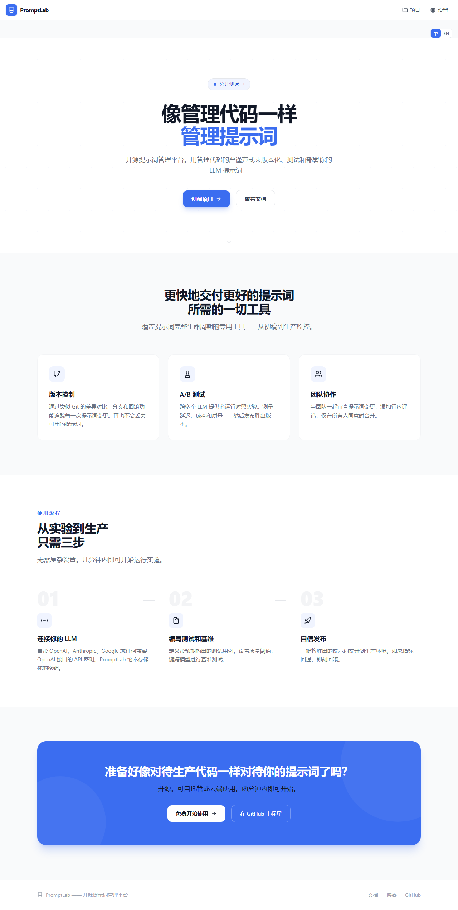
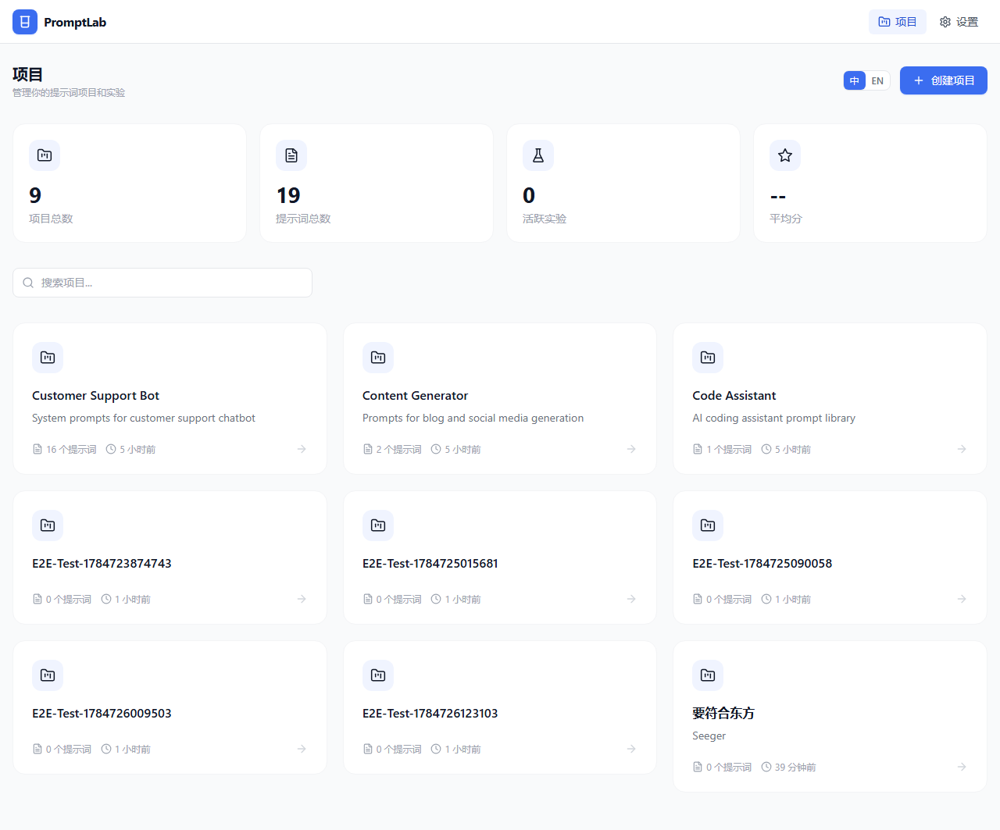
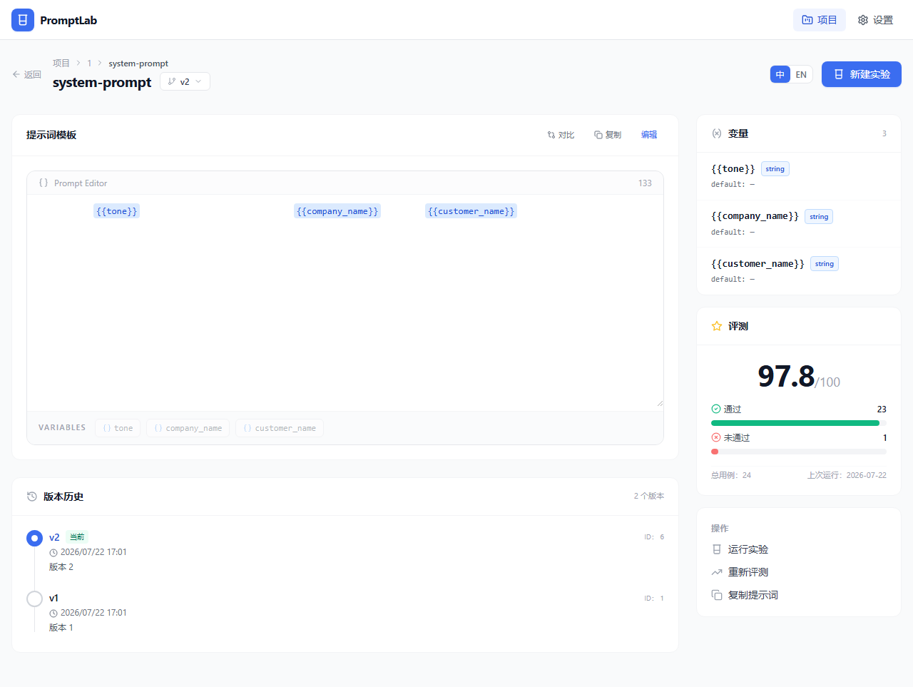
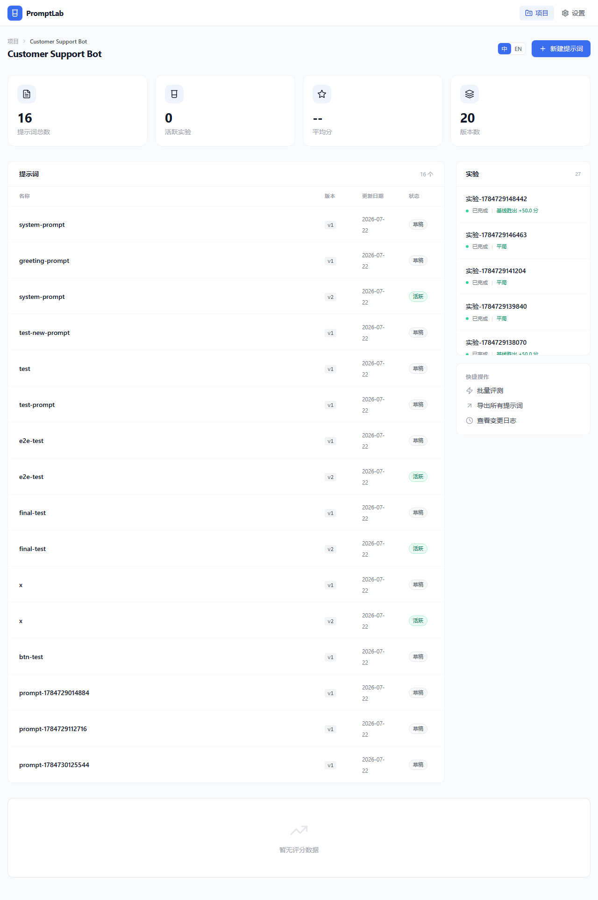
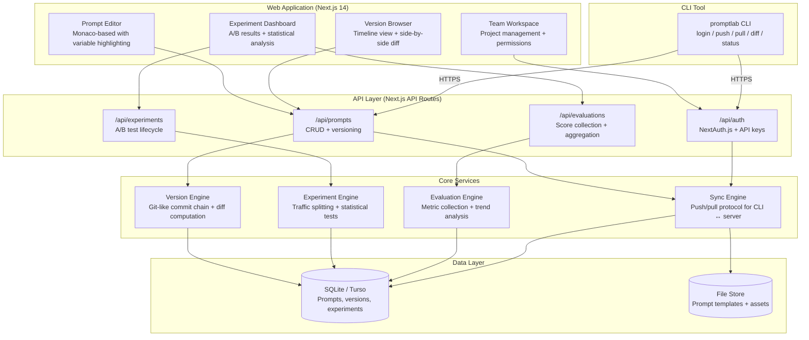

# PromptLab

> Open-source Prompt version control & A/B testing platform. **Git for your prompts.**

[](LICENSE)
[](https://github.com/DevoutZhu/promptlab/actions)
[](https://github.com/DevoutZhu/promptlab/stargazers)
[](https://nextjs.org/)
[](https://www.typescriptlang.org/)
[](CONTRIBUTING.md)

[中文文档](#中文) | [User Guide](docs/user-guide.md) | [Contributing](CONTRIBUTING.md)

---

## Why PromptLab

LLM applications live and die by their prompts. But prompts are scattered across codebases, buried in Notion docs, copy-pasted between Slack threads, and versioned with filenames like `prompt_v3_final_v2.yaml`. When you change a prompt, you have no idea if the new version actually performs better.

PromptLab solves this: **store, version, test, and deploy prompts like code.** Git-style version control for every prompt change, A/B test different prompt versions against each other, and promote winners with a single click.

---

## Quick Start (3 Steps)

```bash
# 1. Clone the repository
git clone https://github.com/DevoutZhu/promptlab.git
cd promptlab

# 2. Install dependencies and start the dev server
pnpm install && pnpm dev

# 3. Open in your browser
# http://localhost:3000
```

**Prerequisites**: Node.js 18+, pnpm 8+

That's it. Create your first project, write a prompt, and start versioning.

---

## Screenshots

| | |
|:---:|:---:|
| **Landing Page** — Hero section with value proposition and quick-start CTA | **Project Dashboard** — Browse all projects, create new ones, view experiment summaries |
|  |  |
| **Prompt Editor** — Write prompts with `{{variable}}` template syntax, version history, and real-time preview | **Experiment Panel** — A/B test prompt versions, view score comparisons, and promote winners |
|  |  |

> Screenshots are captured automatically via Playwright (1280x800, headless Chromium).
> To regenerate: `node scripts/take-screenshots.mjs` (requires `pnpm dev` running on port 3000).

---

## Features

### Version Control

Git-like versioning purpose-built for prompts. Every edit creates a new version. Browse the full history, compare any two versions side-by-side with syntax-highlighted diffs, and roll back to any previous version instantly.

```
v12  feat: add chain-of-thought instruction    2026-07-21   DevoutZhu
v11  fix: reduce token count by 15%             2026-07-20   DevoutZhu
v10  feat: add few-shot examples for edge cases 2026-07-18   alice
```

### A/B Testing

Ship prompts with confidence. Create experiments that compare two prompt versions against live traffic. PromptLab tracks metrics (response quality, latency, token usage, user ratings), computes statistical significance, and tells you when you have a clear winner.

```
┌─────────────────────────────────────┐
│  Experiment: Improve RAG accuracy   │
│  ─────────────────────────────────  │
│  Variant A (v12)    ████████  62%   │
│  Variant B (v14)    ████████████  94%│
│                                     │
│  Winner: Variant B (p < 0.01)       │
│  [Promote to Production]            │
└─────────────────────────────────────┘
```

### Team Collaboration

Share prompt libraries across your team. Organize prompts into projects, set role-based permissions (viewer, editor, admin), and review prompt changes through a pull-request-like workflow. Never lose a prompt to a Slack thread again.

### Evaluation Dashboard

A central hub to monitor prompt quality over time. View score trends, experiment win rates, token usage heatmaps, and team activity. Spot regressions before they impact users.

### CLI Tool

Work with prompts directly from your terminal. Push and pull prompts like you push and pull code.

```bash
promptlab login
promptlab pull my-project/rag-pipeline
promptlab diff --from v11 --to v12
promptlab push my-project/rag-pipeline --message "add CoT reasoning"
promptlab status
```

---

## Tech Stack

| Layer | Technology |
|:------|:-----------|
| Framework | [Next.js 14](https://nextjs.org/) (App Router) |
| Language | [TypeScript](https://www.typescriptlang.org/) 5 |
| Styling | [Tailwind CSS](https://tailwindcss.com/) |
| Database | SQLite (local) / [Turso](https://turso.tech/) (production) |
| ORM | [Drizzle ORM](https://orm.drizzle.team/) |
| Charts | [Recharts](https://recharts.org/) |
| CLI | Node.js + [Commander.js](https://github.com/tj/commander.js) |
| Diff Engine | Custom prompt-aware diff (whitespace-tolerant, template-variable-aware) |

---

## Architecture



---

## Documentation

| Document | Description |
|:---------|:------------|
| [User Guide](docs/user-guide.md) | Full walkthrough: projects, prompts, versioning, A/B testing, CLI |
| [Contributing](CONTRIBUTING.md) | How to contribute to PromptLab |
| [API Reference](https://github.com/DevoutZhu/promptlab/wiki/API) | REST API documentation (Wiki) |
| [Roadmap](https://github.com/DevoutZhu/promptlab/wiki/Roadmap) | Upcoming features and milestones |

---

## Community

- **Issues**: [GitHub Issues](https://github.com/DevoutZhu/promptlab/issues)
- **Discussions**: [GitHub Discussions](https://github.com/DevoutZhu/promptlab/discussions)
- **中文社区**: 加入微信群获取支持和最新动态 (coming soon)

---

## License

PromptLab is open-source under the [Apache License 2.0](LICENSE).

---

## Author

**Devout Zhu** ([@DevoutZhu](https://github.com/DevoutZhu))

---

---

## 中文 {#中文}

# PromptLab

> 大模型 Prompt 版本管理与 A/B 测试平台。**Prompt 的 GitHub。**

## 为什么需要 PromptLab

大模型应用的质量高度依赖 Prompt 的质量。但现实中，Prompt 散落在代码仓库各处、Notion 文档里、Slack 消息中，版本管理全靠文件名：`prompt_v3_final_v2.yaml`。更糟糕的是，当你修改一个 Prompt 后，你根本不知道新版本是否真的更好。

PromptLab 解决这个问题：**像管理代码一样管理 Prompt。** 每次修改自动生成版本记录，A/B 测试不同版本的效果，一键上线获胜版本。

## 快速开始

```bash
# 1. 克隆仓库
git clone https://github.com/DevoutZhu/promptlab.git
cd promptlab

# 2. 安装依赖并启动
pnpm install && pnpm dev

# 3. 打开浏览器访问
# http://localhost:3000
```

**前置条件**: Node.js 18+, pnpm 8+

## 核心功能

| 功能 | 说明 |
|:-----|:-----|
| **版本控制** | Git 风格的 Prompt 版本管理：提交历史、Diff 对比、一键回滚 |
| **A/B 测试** | 对比两个 Prompt 版本的实际效果，统计显著性检验，数据驱动决策 |
| **团队协作** | 共享 Prompt 库，角色权限管理，类 PR 的审核流程 |
| **评估面板** | 集中监控 Prompt 质量：评分趋势、实验胜率、Token 用量热力图 |
| **CLI 工具** | 终端操作 Prompt：登录、拉取、推送、对比、状态查看 |

## 技术栈

Next.js 14 | TypeScript 5 | Tailwind CSS | SQLite/Turso | Drizzle ORM | Recharts

## 文档

- [用户手册](docs/user-guide.md)：完整使用指南（项目、Prompt、版本管理、A/B 测试、CLI）
- [贡献指南](CONTRIBUTING.md)

## 许可证

[Apache License 2.0](LICENSE)

## 作者

**Devout Zhu** ([@DevoutZhu](https://github.com/DevoutZhu))
